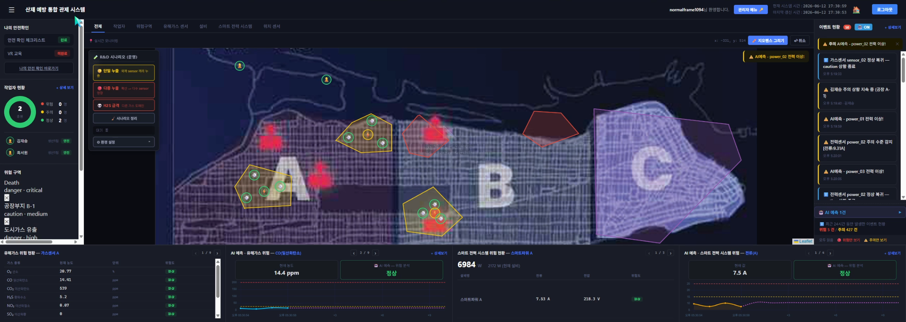
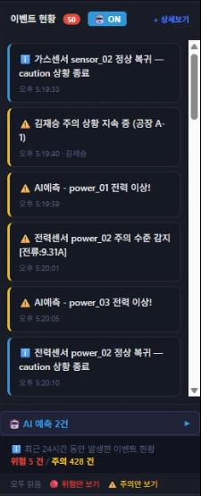
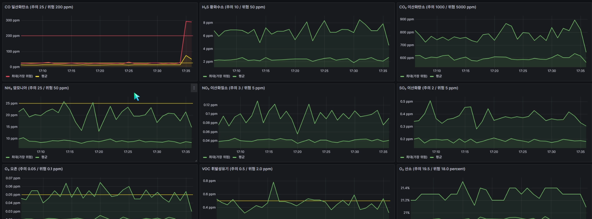
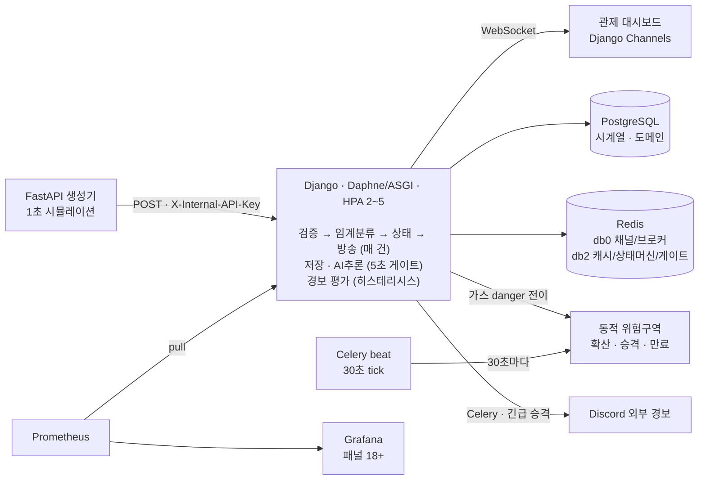
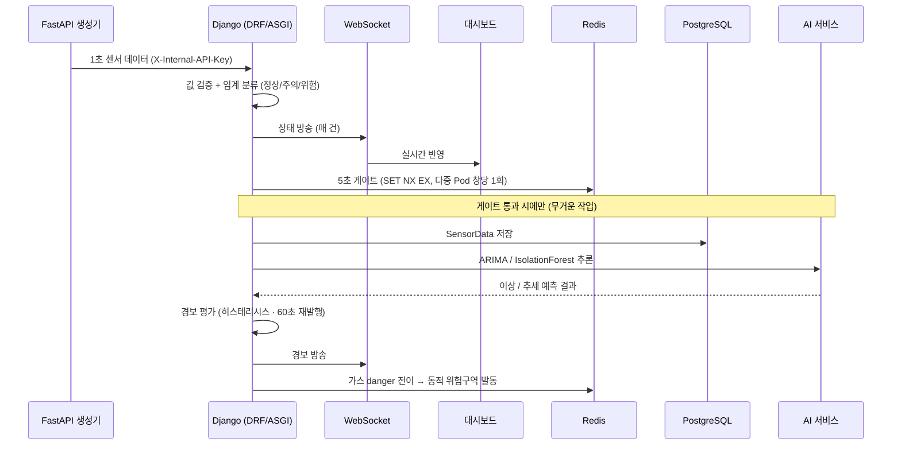

# SenSa | 실시간 유해가스·전력 위험 판정 통합 관제 플랫폼

> 가스·전력 센서와 작업자 위치를 **1초 주기로 수집**해 위험을 판정하고, **실시간 관제 화면과 외부 채널(Discord)로 즉시 경보**하며,
> 가스 누출 시 **물리 모델 기반 동적 위험구역이 자동 생성·확산·승격·만료**되는 산업안전 백엔드 플랫폼.

<!-- TODO(필수): 아래 demo.gif 를 assets/ 에 커밋. 15~30초, 25MiB 미만(=GitHub 웹 업로드 한도).
     추천 장면: 가스 누출 시나리오 토글 → 동적 위험구역이 생성·확산되는 순간 (이 프로젝트의 시그니처) -->


**▶ 전체 시연 영상: [YouTube/Drive 링크 넣기](영상_링크)** · **📄 [기술문서](docs/SenSa_기술문서_최종_v3.docx)** · **🧪 [검증보고서](docs/SenSa_검증보고서_검증3_시나리오동작.docx)**


---

## 프로젝트 한눈에 (30초 요약)

|                 |                                                                                                                      |
| --------------- | -------------------------------------------------------------------------------------------------------------------- |
| **무엇을**      | 산업현장 가스·전력·작업자 위치를 실시간 위험 판정하고, 가스 누출 시 동적 위험구역을 자동 관제                        |
| **왜**          | 임계치를 "넘은 뒤"의 알람은 이미 늦음 → 전이 즉시 경보 + 확산 예측으로 조기 대응                                     |
| **기간 / 인원** | 2026.03 ~ 2026.06 · 부트캠프 팀 프로젝트 4인                                                                         |
| **규모**        | Django 앱 16개 · 약 21,400 LOC                                                                                       |
| **핵심 스택**   | Django(ASGI/Daphne) · Channels · DRF · FastAPI · Celery · Redis · PostgreSQL · Kubernetes(kind) · Prometheus/Grafana |
| **내 기여**     | 수집·판정·방송 파이프라인 · 동적 위험구역 도메인 · 실시간 인프라 · K8s 배포/관측 (AI 알고리즘 내부는 팀원)           |

---

## 핵심 성과 (실 운영 구성 Kubernetes · 다중 replica 실측)

| 항목               | 결과                                                                         |
| ------------------ | ---------------------------------------------------------------------------- |
| 저장 게이트 효율   | 유입 3,464건 → 저장 773건 (**약 −78%**, 상태 전이는 즉시 저장 유지)          |
| 경보 차단율        | **97~98%** (신규 전이는 차단 0, 반복 신호만 억제 — 메트릭으로 검증)          |
| 시나리오 분류 정합 | **95.2%** (n=1,040, 순수 오분류 0건)                                         |
| 다중 Pod 정합성    | 3 replica 동시 운전 중 위험구역 자동 발동 **정확히 1회** (Redis 원자 게이트) |

> 상세 절차·스크린샷은 [검증보고서](docs/SenSa_검증보고서_검증3_시나리오동작.docx)(기술문서 14장 통합) 참조.

---

## 화면 미리보기

<!-- TODO(필수): 아래 3장을 assets/ 에 커밋하고 상대 경로 유지. 권장 3장: 관제 대시보드 / 가스 알람 팝업 / Grafana -->

| 실시간 관제 대시보드               | 가스 알람 팝업                   | Grafana 모니터링               |
| ---------------------------------- | -------------------------------- | ------------------------------ |
|  |  |  |

---

## 핵심 기능

**실시간 수집·판정·방송 파이프라인** — FastAPI 생성기가 1초 주기로 보내는 센서 데이터를 Django가 단일 요청 흐름(값 검증 → 임계 분류 → 저장 → 상태 갱신 → WebSocket 방송 → 경보 평가 → AI 보조 판정)으로 처리합니다. 상태 판정·방송·경보는 매 건, 무거운 저장·AI 추론은 5초 게이트로 솎아 즉시성과 부하를 분리했습니다.

**동적 위험구역 (그레이엄 확산 법칙)** — 센서가 위험으로 전이되는 순간 위험구역이 자동 발동되고, 가스 분자량에 따라 다른 속도(v ∝ 1/√M)로 확산하며, 이웃 센서의 교차 확인으로 잠정 → 확인 → 긴급 tier가 승격됩니다(긴급 승격 시 Discord 발송). 시간 만료와 회복 만료의 이중 경로로 좀비 구역을 방지합니다.

**경보 떨림·폭주 제어** — 상태별 독립 윈도우 카운터(격상 5회 / 회복 7회)로 히스테리시스를 구현해 V자 진동을 차단하고, 동일 경보는 60초 간격으로만 재발행합니다. 억제된 경보 건수까지 메트릭으로 노출해 "조용히 묻은 게 아니라 의도적으로 줄였음"을 수치로 증명합니다.

**복원력 (graceful degradation)** — Redis·채널·외부알림·메트릭 등 보조 기능의 장애가 핵심 경로(저장·판정·생애주기)를 절대 멈추지 않도록 전 구간이 격리돼 있습니다. 상태 저장소는 연결 오류만 흡수하고 코드 버그는 그대로 전파해, 장애 흡수와 버그 은폐를 구분합니다.

---

## 시스템 아키텍처



전체는 kind 단일 노드 Kubernetes(네임스페이스 `sensa`) 위에서 동작하며, 진입은 ingress-nginx를 통합니다. 업로드 파일(평면도)은 PVC 공유 볼륨(`/app/media`)으로 전 Pod에 공동 마운트됩니다.

---

## 데이터 처리 흐름



---

## 기술 스택

| 영역          | 기술                                                                                                  |
| ------------- | ----------------------------------------------------------------------------------------------------- |
| Backend       | Python 3.11 · Django · Django REST Framework · FastAPI                                                |
| Realtime      | Django Channels · WebSocket · ASGI(Daphne)                                                            |
| Async / Queue | Celery (worker + beat) · Redis (db0 브로커·채널 / db2 캐시·상태머신)                                  |
| Database      | PostgreSQL · Django ORM (개발 기본 SQLite, 컨테이너 PostgreSQL 분기)                                  |
| AI / ML       | ARIMA(잔차 이상탐지) · IsolationForest(추세 예측) · 임계 분류기 _(팀원 담당, 함수 인터페이스로 연동)_ |
| Monitoring    | Prometheus · Grafana (패널 18+)                                                                       |
| Infra         | Docker · Kubernetes(kind) · ingress-nginx · HPA                                                       |
| Frontend      | Django Templates · Vanilla JS (서버 렌더 + WebSocket 클라이언트)                                      |
| 인증          | SimpleJWT · 내부 서비스 키(`X-Internal-API-Key`)                                                      |

---

## 주요 설계 포인트

### 실시간성과 저장 안정성 분리

모든 데이터를 매초 DB에 저장하면 부하가 커집니다. 그래서 **상태 판정·WebSocket 방송·경보 평가는 매 건** 처리하고, **DB 저장·AI 추론은 device별 5초 게이트**로 제어합니다. 게이트는 `cache.add`(Redis `SET NX EX`)라 다중 replica에서도 창당 정확히 1회만 통과하며, 캐시 장애 시엔 데이터 유실 방지를 위해 저장 쪽으로 폴백합니다.

```text
매 건 처리      : 임계 분류 → 상태 갱신 → WebSocket 방송 → 경보 평가
5초 게이트 처리 : SensorData INSERT → ARIMA/IsolationForest 추론 → AIPrediction 기록
```

### 알람 폭주 방지 (히스테리시스)

상태별 독립 윈도우 카운터로 격상·회복에 연속 관측을 요구해 임계치 근처의 V자 진동을 차단하고, 동일 경보는 60초 간격으로만 재발행합니다. 억제 건수를 Prometheus 메트릭으로 노출해 효과를 Grafana에서 수치로 확인할 수 있습니다.

### 동적 위험구역 = 물리 모델 기반

그레이엄 확산 법칙(v ∝ √(M_air/M))으로 가스별 확산 반경을 계산합니다. danger '전이' 시점에만 발동하고(지속 danger의 확장·승격·만료는 30초 Celery beat tick이 담당 — 책임 분리), Redis 게이트 + DB active-zone 검사 **이중 중복 방지**를 겁니다. O2는 결핍/과잉의 구간형 위험이라 '누출 확산' 모델이 성립하지 않아 대상에서 제외했습니다.

### graceful degradation의 경계

보조 기능(Redis·외부알림·메트릭)의 장애는 흡수하되, 코드 버그는 전파합니다. 상태 저장소는 `redis.ConnectionError`만 잡고 그 외 예외(ValueError 등)는 그대로 올려 "장애 흡수"와 "버그 은폐"를 구분합니다.

---

## 역할 분담 & 기여 경계

4인 팀 프로젝트입니다. **AI 알고리즘 내부**(ARIMA 이상탐지 · IsolationForest 추세예측 · 임계 분류기)는 담당 팀원이 구현했으며, 명확한 함수 인터페이스로 캡슐화되어 파이프라인은 내부를 알 필요 없이 결과만 소비합니다.

**제가 구현한 영역:**

| 영역                      | 내용                                                                             |
| ------------------------- | -------------------------------------------------------------------------------- |
| 수집·판정·방송 파이프라인 | 센서 수신(`SensorDataView`) · 값 검증 · 5초 저장/AI 게이트 · WebSocket 방송      |
| 동적 위험구역 도메인      | 그레이엄 확산 계산 · 자동 발동(P-AZ) · tier 승격/만료 라이프사이클 · 이벤트 로깅 |
| 경보 신뢰성               | Redis 상태머신 · 히스테리시스 · 재알림/중복 억제 · graceful degradation          |
| 실시간 인프라             | Channels Consumer · 발행 래퍼 · 최신 상태 캐시                                   |
| 배포·관측                 | Kubernetes 매니페스트(01~11) · HPA · Prometheus 메트릭 · Grafana 대시보드        |

<!-- TODO: 팀 공용 레포라면 팀원 이름/담당도 여기에 표기. 개인 포트폴리오면 위 표 그대로 두고 상단 '내 기여'와 일치시키세요. -->

---

## 빠른 시작

**요구사항:** Docker · kind(또는 Docker Desktop K8s) + 로컬 레지스트리 `localhost:5000` · ingress-nginx · kubectl

```bash
# 1) 최초 부트스트랩 — 매니페스트 순서 적용
kubectl apply -f manifests/01_namespace.yaml
kubectl apply -f manifests/02_config_secret.yaml -f manifests/02b_config_patch.yaml
kubectl apply -f manifests/03_postgres.yaml -f manifests/04_redis.yaml
kubectl apply -f manifests/05b_media_pvc.yaml -f manifests/05_django.yaml
kubectl apply -f manifests/06_celery.yaml -f manifests/07_generator.yaml
kubectl apply -f manifests/08_prometheus.yaml -f manifests/09_grafana.yaml
kubectl apply -f manifests/10_ingress.yaml -f manifests/11_hpa.yaml

# 2) 이미지 빌드·반영 (이후 코드 수정 시에도 이 한 줄)
./redeploy.sh    # 시각 기반 고유 태그 빌드 → push → django+celery 동시 롤아웃

# 3) 관리자 계정 (시드가 superuser는 만들지 않음)
kubectl exec -n sensa deploy/django -c django -it -- python manage.py createsuperuser
```

**접속:** 관제 대시보드 `http://sensa.localhost` · Grafana `http://grafana.localhost`
(생성기·Prometheus 직접 확인: `kubectl port-forward -n sensa svc/generator 8001:8001`, `svc/prometheus 9090:9090`)

마이그레이션은 Django Pod 기동 시 initContainer가 자동 실행하며, 정적 파일은 이미지 빌드 단계의 `collectstatic`으로 수집됩니다.

### 시나리오 시연 (R&D 토글)

명령 한 번으로 사고 시계열(정상 → 전조 → 주의 → 위험 → peak → 복귀)이 자동 전개됩니다.

```bash
# H2S 누출 시나리오 시작 — 약 60~90초 후 위험 돌파, 위험구역 자동 생성
curl -X POST 'localhost:8001/anomaly/toggle?device_id=sensor_01&state=true'

curl localhost:8001/anomaly/state          # phase 진행 확인
curl -X POST 'localhost:8001/anomaly/toggle?device_id=sensor_01&state=false'   # 복귀
curl -X POST 'localhost:8001/anomaly/clear-all'                                # 전체 초기화
```

매핑: `sensor_01`=G3 H₂S 누출 · `sensor_02`=G4 CO 연소이상 · `sensor_03`=G1 환기 불량 · `power_01`=P1 과부하 · `power_02`=P3 전압 강하.
생성 데이터에는 `expected_status` 라벨이 동봉돼 분류 정합을 사후 정량 검증할 수 있습니다.

---

## 테스트 및 검증

| 검증 항목       | 확인 내용                                                        |
| --------------- | ---------------------------------------------------------------- |
| 데이터 수집     | FastAPI 생성기 1초 주기 수신 · 음수/비정상값 방어                |
| DB 저장 게이트  | 5초 창당 1건 저장, 상태 전이는 즉시 저장 (유입 대비 −78%)        |
| WebSocket       | 센서 상태·작업자 위치·알람·위험구역 실시간 반영                  |
| AI 추론         | 이상 패턴 주입 시 ARIMA/IsolationForest 결과 + AIPrediction 검증 |
| 알람 억제       | 히스테리시스·재발행·dedup 적용 (차단율 97~98%)                   |
| 동적 위험구역   | danger 전이 시 자동 발동 · 확산 · tier 승격 · 이중 만료          |
| 다중 Pod 정합성 | 3 replica 동시 운전 중 자동 발동 정확히 1회                      |
| 모니터링        | Prometheus 메트릭 · Grafana 패널(18+)                            |

상세 절차·스크린샷·시나리오 정답 라벨 대조는 [검증보고서](docs/SenSa_검증보고서_검증3_시나리오동작.docx) 참조.

---

## 한계와 향후 과제 (인지된 상태)

단일 Redis·PostgreSQL은 SPOF(데모 규모의 의도적 단순화)이며, **임계값이 코드·DB·프런트 세 곳에 존재해 단일화가 1순위 후속 과제**입니다. 업로드 볼륨의 RWO는 단일 노드 전제로, 다중 노드 확장 시 RWX/오브젝트 스토리지 전환이 필요합니다. Alertmanager·시스템 알람 규칙·CI 자동 테스트는 미구성이고(이미지 고유 태그는 적용됨), 운영 중 kubectl 직접 변경으로 인한 매니페스트 드리프트를 경험·동기화한 사례로부터 GitOps 도입 필요성을 확인했습니다.

---

## 프로젝트 구조

| 디렉터리                                                              | 책임                                                     |
| --------------------------------------------------------------------- | -------------------------------------------------------- |
| `SenSa/devices`                                                       | 센서 수신구(`SensorDataView`) · 근접 그래프              |
| `SenSa/alerts`                                                        | 경보 평가기 · 상태머신(Redis) · AI 서비스 · 외부 알림    |
| `SenSa/geofence`                                                      | 위험구역 확산 · 생애주기 · 자동 발동 · 이벤트 · 시나리오 |
| `SenSa/realtime`                                                      | WebSocket consumer · 발행 래퍼 · 최신 상태 캐시          |
| `SenSa/backoffice`                                                    | 마스터데이터 · 권한 · 감사 · 알림 디스패치 · 백업        |
| `SenSa/dashboard` · `workers` · `accounts` · `safety` · `vr_training` | 관제 UI · 작업자 · 인증 · 부가기능                       |
| `fastapi_generator/`                                                  | 센서 데이터 생성기 + R&D 시나리오 토글                   |
| `manifests/`                                                          | Kubernetes 매니페스트 (01 → 11 순서 적용)                |
| `sensa_observability/`                                                | Prometheus 설정 · Grafana 대시보드(JSON)                 |

---

## 문서

- 📄 [기술문서 (최종 v3)](docs/SenSa_기술문서_최종_v3.docx) — 설계·구현·운영 전체
- 🧪 [검증보고서 (시나리오 동작)](docs/SenSa_검증보고서_검증3_시나리오동작.docx) — 실측 절차·결과
- 🗂️ [merge_history.md](SenSa/docs/merge_history.md) — 병합 이력

<!-- TODO: 위 .docx 2개가 docs/ 에 실제 커밋돼 있는지 확인(현재 폴더엔 merge_history.md 만 존재).
     GitHub은 .docx 인라인 미리보기가 안 되니, 핵심 문서는 PDF 병행을 권장(클릭 없이 면접관이 열람 가능). -->

---

## Contact

<!-- TODO: 본인 정보로 교체 -->

- **GitHub:** [@your-github-id](https://github.com/your-github-id)
- **Email:** your-email@example.com
- **Portfolio:** 포트폴리오 링크
